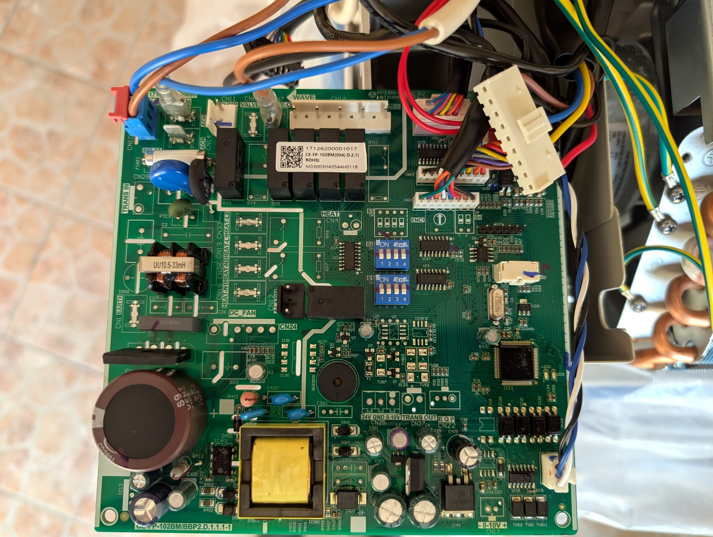
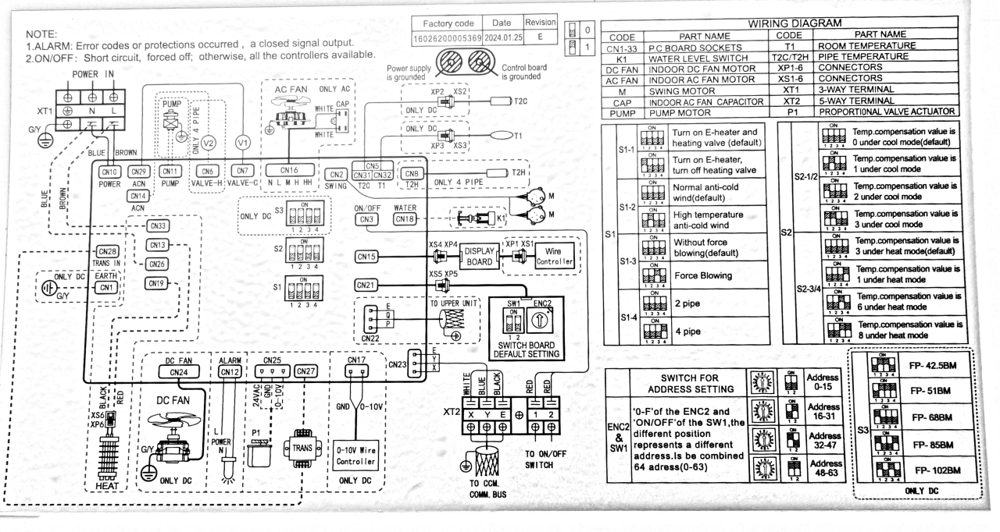

# MDV Fancoil MQTT ↔ RS-485 Agent

A Python agent that bridges a **Midea MKG-300-C** fancoil unit to any MQTT-based smart home system via the proprietary **XYE RS-485 bus**.



## Why This Project Exists

There are several community efforts to integrate Midea / MDV / XYE-based HVAC into smart homes:

- **[xye (Codeberg)](https://codeberg.org/xye/xye)** — the foundational reverse-engineering of the XYE protocol (Erlang-based, tested on CCM/01E and Mundo Clima MUCSR-12-H8).
- **[Yocee84/Midea-FanCoil-ESPHome](https://github.com/Yocee84/Midea-FanCoil-ESPHome)** — ESPHome component for Midea fancoils.

However, the **Midea MKG-300-C** unit we are working with has two key differences that make existing solutions incompatible out of the box:

1. **XYE data format deviations.** The MKG-300-C speaks a variant of the XYE protocol that diverges from the published specifications in several critical ways (see [Protocol Differences](#protocol-differences-from-vanilla-xye) below). Directly applying the known frame layouts produces incorrect parsing and failed commands.

2. **No PQE port.** The controller board of our unit does not have the PQE diagnostic port populated — only the XYE bus connector is available. This limits the integration approach to the RS-485 bus protocol exclusively and rules out PQE-based board identification (revision, manufacturing date).

These differences required a clean-room re-implementation: the protocol schema was rebuilt from scratch by sniffing live traffic from the unit and verifying every field against actual device behavior.

## Hardware

| Component | Details |
|-----------|---------|
| Fancoil | Midea MKG-300-C |
| Bus | RS-485 (XYE connector: X = A, Y = B, E = GND) |
| Electrical | 4800 baud, 8N1 |
| Adapter | **Waveshare USB to RS232/485 Serial Cable** ([SKU 29573](https://www.waveshare.com/catalogsearch/result/?q=29573)) |



> **⚠ RS-485 adapter compatibility.** Multiple USB ↔ RS-485 adapters were tested — both from local stores and AliExpress. None of them produced a clean signal on the XYE bus: an oscilloscope showed a high noise level when these adapters were connected. Only the **Waveshare USB to RS232/485 Serial Cable (SKU 29573)** worked reliably enough to capture and decode bus traffic.

## Protocol Differences from Vanilla XYE

All differences were discovered and verified on a live MKG-300-C unit (2025-02):

| Aspect | Vanilla XYE (xye.md) | MKG-300-C |
|--------|----------------------|-----------|
| Preamble | `AA` | `FE AA` (extra `0xFE` byte) |
| TX frame length | 16 bytes | 17 bytes (FE + 16) |
| RX frame length | 32 bytes ending with `CRC 55` | 32 bytes ending with `CRC` (no trailing `0x55`) |
| CRC formula | `255 - sum(data) % 256 + 1` | `255 - (sum(frame[1:crc_pos]) + 0x55) % 256` |
| AUTO mode value | `0x10` (ON = `0x90`) | `0x11` (ON = `0x91`) |
| `mode_flags` RX offset | Byte 21 (`0x14`) | **Byte 18** (`0x11`) — confirmed by ECO/SWING tests |
| Fan status byte | Reports actual speed | Composite byte: bit7=AUTO, bit2=status, bits0-1=speed (always 0 for manual) |

## Features

- **Schema-driven** — all protocol constants, offsets, and field values live in `schema.yaml`. Zero magic numbers in code.
- **Full SET command support** — mode (COOL / HEAT / FAN / DRY / AUTO), fan speed (AUTO / HIGH / MED / LOW), temperature setpoint, ECO, SWING, LOCK / UNLOCK. All verified on hardware.
- **MQTT bridge** — publishes JSON state, accepts JSON commands, supports LWT (availability topic).
- **Interactive test mode** — CLI shell (`--test`) for protocol exploration: query, set, raw frame send, CRC calculator, bus scan.
- **Temperature clamping** — setpoint is clamped to 17–30 °C per R51 remote specification.
- **Robust serial handling** — auto-reconnect, input buffer drain before each transaction.

## Quick Start

### 1. Install dependencies

```bash
pip install -r requirements.txt
```

### 2. Configure

Edit `schema.yaml`:
- `serial.port` — your COM port or `/dev/ttyUSB0`
- `serial.address` — device address on the bus (default `0x00`)

For MQTT credentials, create `.env.yaml` (gitignored):

```yaml
mqtt:
  broker: "10.168.1.4"
  port: 1883
  username: "user"
  password: "secret"
```

### 3. Run

**MQTT agent mode** (production):

```bash
python mqtt_rs485_agent.py --config schema.yaml --debug
```

**Interactive test mode** (protocol exploration):

```bash
python mqtt_rs485_agent.py --config schema.yaml --test --debug
```

## Interactive Test Commands

```
xye> query              — poll device status
xye> set COOL AUTO 24   — set mode=COOL, fan=AUTO, temp=24°C
xye> set OFF AUTO 24    — turn off
xye> lock               — lock the unit (oper_flags 0x80)
xye> unlock             — unlock
xye> scan 0 63          — scan all 64 bus addresses
xye> raw FE AA C0 ...   — send arbitrary hex bytes
xye> crc FE AA C0 ...   — calculate/verify CRC for a frame
```

## MQTT Interface

### State (published)

Topic: `homeassistant/climate/mdv_fancoil/state`

```json
{
  "power": true,
  "mode": "COOL",
  "fan": "AUTO",
  "setpoint": 24,
  "t1": 23.5,
  "t2a": 22.0,
  "mode_flags": ["SWING"],
  "oper_flags": ["PUMP"],
  "errors": [],
  "protections": []
}
```

### Command (subscribe)

Topic: `homeassistant/climate/mdv_fancoil/set`

```json
{
  "power": true,
  "mode": "COOL",
  "fan": "AUTO",
  "temp": 24,
  "mode_flags": ["ECO"]
}
```

### Availability

Topic: `homeassistant/climate/mdv_fancoil/availability` — `online` / `offline` (LWT).

## Project Structure

```
├── mqtt_rs485_agent.py    # Main agent: XYEProtocol + SerialTransport + MQTTBridge + InteractiveTester
├── schema.yaml            # Protocol schema (offsets, field values, MQTT topics)
├── .env.yaml              # MQTT credentials (gitignored)
├── requirements.txt       # Python dependencies
├── xye.md                 # Original XYE protocol reference
├── test_set_commands.py   # Phase 1 automated hardware tests (modes, fan, temp)
├── test_phase2.py         # Phase 2 automated hardware tests (ON/OFF, ECO, SWING, LOCK)
└── img/
    ├── MKG-300-C-board.jpg    # Fancoil controller main board
    └── MKG-300-C-wiring.png   # Fancoil wiring diagram
```

## Verified Commands Summary

| Command | Status | Notes |
|---------|--------|-------|
| Query (GET) | ✅ | Polls full device state |
| Mode: COOL | ✅ | `0x88`, ON = `0x88 \| 0x80` |
| Mode: HEAT | ✅ | `0x04`, Heat Pump models only |
| Mode: FAN | ✅ | `0x01`, temp byte = `0xFF` |
| Mode: DRY | ✅ | `0x02` |
| Mode: AUTO | ✅ | `0x11` (not `0x10` as in xye.md) |
| Fan: AUTO | ✅ | `0x80` |
| Fan: HIGH / MED / LOW | ✅ | `0x01` / `0x02` / `0x03` — accepted, status always shows MANUAL |
| Temperature | ✅ | 17–30 °C, clamped |
| ECO | ✅ | `mode_flags` bit 0 at RX byte 18 |
| SWING | ✅ | `mode_flags` bit 2 at RX byte 18 |
| LOCK / UNLOCK | ✅ | `oper_flags` bit 7 — immediate effect |
| ON / OFF | ✅ | OFF = mode byte `0x00`, setpoint defaults to 17 |
| TURBO | ⬜ | Untested |
| Timer | ⬜ | Untested (timer RX offset uncertain) |

## Known Quirks

- **SET response contains the previous state**, not the new one. A follow-up QUERY is needed to read back the applied values.
- **Fan speed is not reported in status.** MKG-300-C always reports `0x00` for manual fan speed bits — you can tell AUTO vs MANUAL, but not which manual speed is active.
- **PUMP flag persists across mode changes.** The `oper_flags` PUMP bit (`0x04`) doesn't clear instantly when switching from COOL to FAN — it reflects hardware state (compressor/pump was recently active).
- **AUTO mode forces AUTO fan** (per R51 manual), but the fan byte does NOT set bit 7 — the device controls fan speed internally without advertising it.

## References

- [XYE Protocol (Codeberg)](https://codeberg.org/xye/xye) — original reverse-engineered XYE specification
- [Yocee84/Midea-FanCoil-ESPHome](https://github.com/Yocee84/Midea-FanCoil-ESPHome) — ESPHome integration for Midea fancoils
- R51 IR Remote Controller Manual — temperature range, mode/fan behavior

---

> **Note:** All code in this repository was generated by AI (GitHub Copilot, Claude) and verified against a live Midea MKG-300-C unit.
